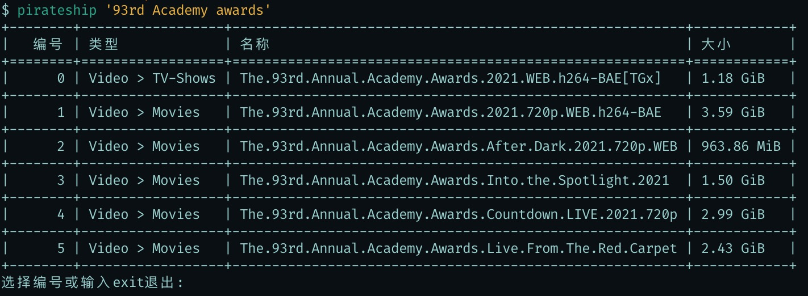

# 终端搜索piratebay工具

## 安装

```shell
pip3 install -r requirements.txt
```

## 使用

```shell
python3 pirateship.py "{关键字}"
```

## 使用代理以及指定域名(默认thepiratebay.org不可用的时候)

```shell
在~/.pirateship/config文件中添加环境变量:
	PROXY_HOST={socks5代理域名}
	PROXY_PORT={socks5代理端口}
	PIRATE_URL={海盗湾主URL}
	PIRATE_API_URL={海盗湾API URL(部分版本的海盗湾API URL和主URL一致)}
```


